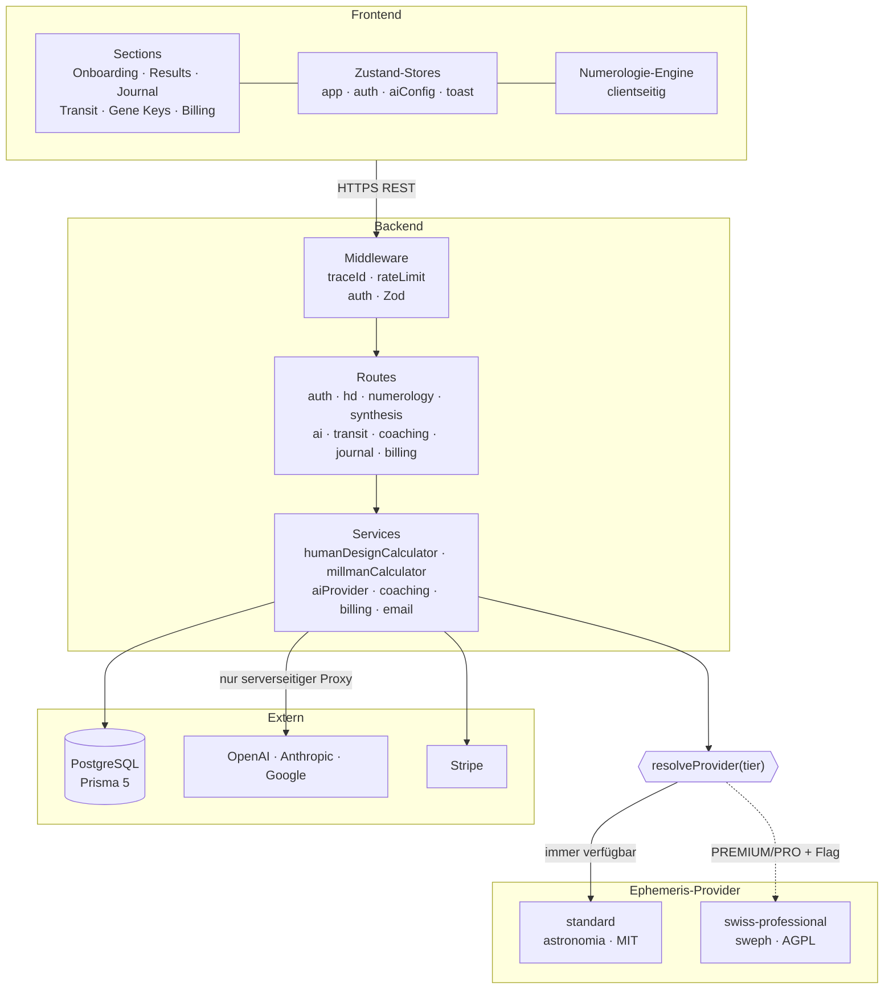
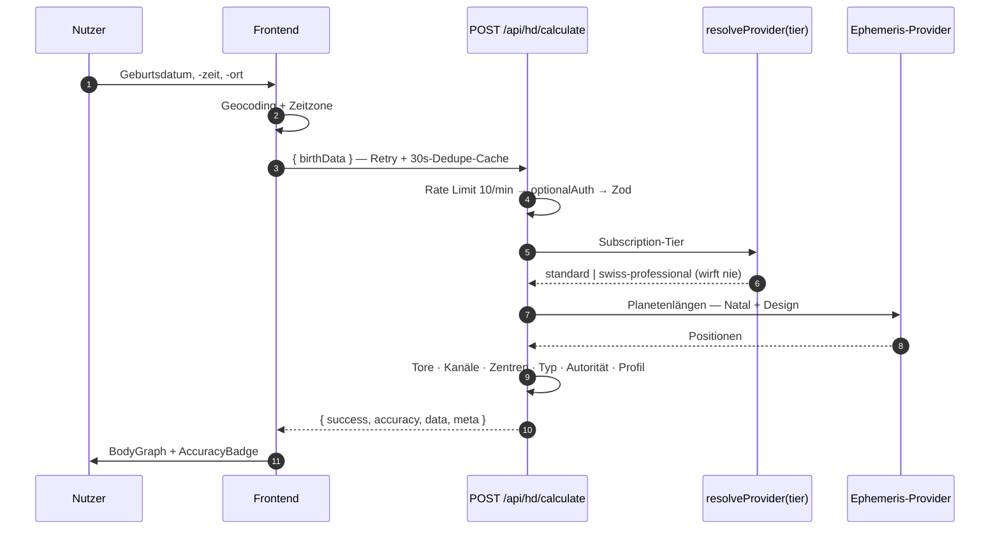

<div align="center">

<picture>
  <source media="(prefers-color-scheme: dark)" srcset=".github/assets/hero-dark.svg">
  <source media="(prefers-color-scheme: light)" srcset=".github/assets/hero-light.svg">
  
</picture>

<br>

[English](README.md) · **Deutsch**

<br>

[](#-projektstatus)
[](#-tests--qualität)
[](LICENSE)

[](https://react.dev)
[](https://www.typescriptlang.org)
[](https://nodejs.org)
[](https://vitejs.dev)
[](https://prisma.io)
[](https://pnpm.io)

<br>

[**Was es anders macht**](#-warum-das-keine-weitere-astrologie-app-ist) ·
[**Funktionen**](#-was-die-app-kann) ·
[**Präzision**](#-die-präzisions-staffelung) ·
[**Architektur**](#-architektur) ·
[**API**](#-api-oberfläche) ·
[**Status**](#-projektstatus) ·
[**Kontakt**](#-kontakt)

</div>

---

> **📌 Über dieses Repository.** Synthesis Engine ist ein kommerzielles Produkt in
> aktiver Entwicklung. Der Quellcode liegt in einem **privaten** Repository — dieses hier
> ist ein öffentliches Showcase, das die Architektur, die technischen Entscheidungen und
> die gemessenen Behauptungen hinter dem Produkt dokumentiert, für jeden, der die Arbeit
> beurteilen möchte. Nichts hier ist ein Platzhalter oder Mockup — jede Zahl, jedes
> Diagramm und jede Design-Entscheidung unten beschreibt das echte, laufende System.
> Für einen genaueren Blick in den Code — als Mitarbeiter, Arbeitgeber oder Investor —
> siehe [Kontakt](#-kontakt).

**Synthesis Engine** nimmt einen Satz Geburtsdaten und liefert **ein** kreuzkorreliertes
Profil aus drei symbolischen Systemen — **Human Design**, **Gene Keys** und
**Dan-Millman-Numerologie** — und lässt anschließend ein Sprachmodell über alle drei
gleichzeitig nachdenken.

Die Astronomie darunter ist keine Dekoration. Planetenpositionen werden **serverseitig**
gegen einen **veröffentlichten, reproduzierbaren Genauigkeits-Benchmark** berechnet, und
welche Präzisionsstufe ein Request bekommt, ist eine explizite, einsehbare Eigenschaft
der Antwort.

---

## ◈ Warum das keine weitere Astrologie-App ist

Die meisten Projekte in diesem Feld liefern ein System, behaupten „präzise Berechnungen"
ohne je eine Zahl zu nennen, und ziehen still eine Copyleft-Ephemeride in den Build.
Hier läuft es andersherum.

| Üblich | Hier |
|---|---|
| Ein System, isoliert gelesen | **Drei Systeme**, kreuzkorreliert zu einer Synthese |
| „Hochpräzise" — ohne Zahl | **Eine gemessene Fehlertabelle**, per automatisiertem Test gegen eine Swiss-Ephemeris-Fixture abgesichert |
| AGPL-Bibliothek im Haupt-Build | **Lizenz-isolierte Provider-Architektur** — die CI lässt den Build durchfallen, wenn AGPL-Code das Standard-Image erreicht |
| „Deine Daten verlassen nie dein Gerät" | **Eine ehrliche Datenfluss-Aussage** — die alte Behauptung war nach dem Web-Pivot falsch und wurde zurückgezogen statt umformuliert |
| Vertraut den Zahlen des Clients | **Der Server rechnet alles neu, was er speichert** |
| Secrets im `localStorage`, später entdeckt | **Automatisierte Tests belegen, dass Tokens und API-Keys nie persistiert werden** |

> Der Datenschutz-Punkt wiegt am schwersten. Dieses Projekt war einmal eine
> Tauri-Desktop-App und warb damit, dass Geburtsdaten das Gerät nie verlassen. Mit dem
> Wechsel auf die Web-Architektur stimmte das nicht mehr — also wurde der Satz entfernt
> statt umformuliert. Was heute tatsächlich passiert, steht unter
> [Sicherheit & Datenschutz](#-sicherheit--datenschutz).

---

## ◈ Was die App kann

<table>
<tr>
<td width="50%" valign="top">

### ⬢ Human Design

Vollständiger BodyGraph aus Geburtsdaten — **9 Zentren**, Energie-Typ
(Manifestor · Generator · MG · Projektor · Reflektor), Autorität,
Profillinien 1–6, alle **64 Tore** mit planetaren Aktivierungen,
Kanal-Analyse und PHS-Variablen, als SVG gerendert.

</td>
<td width="50%" valign="top">

### ⬢ Gene Keys

Alle **64 Keys** über die drei Frequenzen —
**Schatten → Gabe → Siddhi** — zusammengesetzt zu einem
hologenetischen Profil mit Kontemplations-Fragen.

</td>
</tr>
<tr>
<td width="50%" valign="top">

### ⬢ Millman-Numerologie

Lebensweg (z. B. `35/8`), Wurzelzahlen, Meisterzahlen (11 / 22),
Null-Verstärker-Logik, Seelenweg (Vokale), Berufsweg (Konsonanten),
die vier Herausforderungen, Höhepunkte nach Lebensaltern,
Persönliches Jahr.

</td>
<td width="50%" valign="top">

### ⬢ KI-Synthese & Coaching

OpenAI · Anthropic · Google, immer über einen Backend-Proxy —
nie direkt aus dem Browser aufgerufen. Sokratisch statt belehrend,
kreuzkorreliert über alle drei Systeme. Ergebnisse 30 Tage gecacht.

</td>
</tr>
<tr>
<td width="50%" valign="top">

### ⬢ Transits

Tägliche Planetenpositionen, Vergleich mit dem Natal-Chart,
Zeitraum-Scans und Mondphasen.

</td>
<td width="50%" valign="top">

### ⬢ Journal · PDF · Billing

Serverseitiges Journal am Konto (Gast-Modus bleibt lokal und wird
beim ersten Login einmalig migriert), PDF-Export von Charts und
Reports, Stripe-Checkout, -Portal und -Webhooks.

</td>
</tr>
</table>

---

## ◈ Die Präzisions-Staffelung

Astronomische Genauigkeit ist hier ein **Produkt-Tier**, kein Marketing-Adjektiv. Zwei
austauschbare Provider liegen hinter einem gemeinsamen Interface, ausgewählt pro
Request von einem Resolver, der das Subscription-Tier liest.

|  | `standard` | `swiss-professional` |
|---|---|---|
| **Tiers** | FREE · BASIC · Gäste | PREMIUM · PRO |
| **Bibliothek** | `astronomia` — Meeus (VSOP87, ELP2000-82) | Swiss Ephemeris (`sweph`) |
| **Lizenz** | **MIT** — im Standard-Image enthalten | **AGPL** / kommerzielle Astrodienst-Lizenz |
| **Genauigkeit** | Sonne `0,0059°` · Mond `0,0152°` · Planeten `≤ 0,0094°` | `±0,0001°` (Referenz) |
| **Chiron** | nicht verfügbar — wird in der Antwort explizit ausgewiesen | enthalten |
| **Nativer Build** | keiner | node-gyp, per Feature-Flag |

Gemessen gegen eine Swiss-Ephemeris-2.10.03-Fixture über **10 Stichtage von 1950–2030**.
Zur Einordnung: ein Human-Design-Tor ist **5,625°** breit — der schlechteste Fall des
Standard-Providers ist rund **370× schmaler** als die kleinste Einheit, die das Chart
überhaupt auflöst. Die Retrograd-Erkennung stimmt in jeder Stichprobe exakt.

**Der Resolver wirft nie.** Flag aus, Modul fehlt, nativer Ladefehler — jeder Fall fällt
still auf `standard` zurück. Ein Downgrade kostet Präzision, aber liefert nie einen
Fehler.

```
EPHEMERIS_PRO_ENABLED=true  +  sweph ladbar  +  Tier ∈ {PREMIUM, PRO}
                              ↓ eine Bedingung nicht erfüllt
                          Standard-Provider
```

Jede Chart-Antwort trägt ihre eigene Herkunft, und die UI zeigt sie als
`AccuracyBadge`:

```jsonc
{
  "success": true,
  "accuracy": "STANDARD",           // oder "PROFESSIONAL"
  "data":  { /* Chart */ },
  "meta":  {
    "ephemerisProvider": "standard",
    "usingEphemeris":    true,
    "missingBodies":     ["CHIRON"],
    "calculationTimeMs": 42
  }
}
```

---

## ◈ Architektur

Web-only. React 19 + Vite sprechen REST mit Express + Prisma. **Jede astronomische
Berechnung läuft serverseitig.**



### Wie ein Chart-Request tatsächlich läuft



<details>
<summary><b>Repo-Struktur (privates Repository)</b></summary>

```
synthesis-engine/
├── app/            React 19 · Vite · TypeScript
│   ├── sections/   Seiten-Level-Flows
│   ├── pages/      Route-Level-Seiten (Dashboard, Auth, Billing)
│   ├── components/ Fachkomponenten + shadcn/ui
│   ├── stores/     Zustand: app · auth · aiConfig · toast
│   ├── lib/        api · journal · numerologie · gene keys
│   └── services/   PDF-Export (jsPDF + html2canvas)
│
├── backend/        Node 20 · Express 4 · Prisma 5
│   ├── routes/     9 Router, gemountet unter /api
│   ├── middleware/ auth (JWT/RBAC/Tier) · Rate Limiting · Trace-IDs
│   ├── services/   Geschäftslogik, inkl. Ephemeris-Provider-Architektur
│   ├── lib/        Config · Logging · SSRF-Guard · Billing
│   └── tests/      Jest + Supertest, 214 Fälle
│
├── prisma/         Schema · Seed · handgeschriebene SQL-Migrationen
└── .github/        CI: Lint → Build → Test, plus Docker-Lizenz-Wache
```

</details>

---

## ◈ API-Oberfläche

Alles liegt unter `/api` hinter einem Rate Limiter (Default **100 Req/Min**,
konfigurierbar). JSON-Bodies sind auf **1 MB** begrenzt. Ein `/health`-Endpunkt prüft
die DB-Konnektivität.

| Präfix | Endpunkte | Zugriff |
|---|---|---|
| `/auth` | Registrierung · Login · Refresh · Logout · Profil · Passwort-Reset · E-Mail-Verifizierung | gemischt — Credential-Routen sind separat rate-limitiert |
| `/hd` | Berechnen · Speichern · Profil · Stats · Health · Diagnostics | `calculate` optional-auth · `diagnostics` nur **ADMIN** |
| `/numerology` | Speichern · Profil · Stats · Soulmates | überwiegend authentifiziert |
| `/synthesis` | Generieren · Cache-Abruf | nur **PREMIUM / PRO**, rate-limitiert |
| `/ai` | Proxy · Modelle · Kostenschätzung | `proxy`: nur **PREMIUM / PRO** |
| `/transit` | Täglich · Heute · Vergleich · Zeitraum · Mondphasen | gemischt |
| `/coaching` | Täglich · Als gelesen markieren · Historie | `daily`: nur **PREMIUM / PRO** |
| `/journal` | vollständiges CRUD | authentifiziert |
| `/billing` | Checkout · Portal · Subscription · Webhook | authentifiziert — Webhook wird vor dem JSON-Parser gemountet, wegen der Signaturprüfung |

> **Zwei bewusste Design-Entscheidungen.** Der Auth-Rate-Limiter hängt **pro Route**,
> nicht am ganzen `/auth`-Präfix — am Präfix würde er die Endpunkte drosseln, die der
> Client bei jedem App-Start aufruft. Und der Stripe-Webhook wird vor dem
> JSON-Body-Parser gemountet, weil die Signaturprüfung den Raw-Body braucht.

---

## ◈ Technologie-Stack

<table>
<tr><td valign="top" width="50%">

**Frontend**

| | |
|---|---|
| React | 19.2 |
| TypeScript | 5.9 |
| Vite | 7.2 |
| Tailwind CSS | 3.4 |
| shadcn/ui (new-york) | Radix |
| Framer Motion | 12 |
| Zustand + immer | 5 |
| React Router | 8 |
| jsPDF + html2canvas | Export |

</td><td valign="top" width="50%">

**Backend**

| | |
|---|---|
| Node.js | 20+ |
| Express | 4.18 |
| Prisma | 5.22 |
| PostgreSQL | 15+ |
| astronomia (MIT) | Standard-Ephemeris |
| sweph (AGPL, optional) | Professional-Ephemeris |
| OpenAI SDK | 4.x |
| Stripe | 22 |
| pino | Logging |

</td></tr>
</table>

---

## ◈ Tests & Qualität

Die Backend-Test-Suite läuft **ohne Datenbank und ohne native Compilation** — externe
Dienste sind gemockt, damit die Suite schnell und deterministisch bleibt.

| Bereich | Runner | Umfang |
|---|---|---|
| Backend | Jest + Supertest | **214 Fälle / 20 Suites** — Auth, Human Design, Rate Limits, AI-Proxy, SSRF-Guard, Coaching, Journal, Synthesis, Billing + Webhooks, E-Mail, Ephemeris, Tier-Matrix |
| Frontend | Vitest (happy-dom) | **49 Fälle / 8 Suites** — Berechnungen, Journal- & Billing-API, Auth-/KI-Config-Stores, Accuracy-Badge, Auth-Seiten |
| End-to-End | Playwright | Smoke-Test über den Kern-Nutzerpfad |

Drei Suites sind **tragende Sicherheitsaussagen**, keine Routine-Abdeckung:

- Zwei Suites belegen, dass Access-Tokens und KI-Provider-Keys **nie** in den
  Browser-Speicher geschrieben werden. Sie waren einmal übersprungen, und genau dadurch
  ging eine falsche Sicherheitsaussage direkt in der UI live — sie bleiben in der CI,
  um genau das zu verhindern.
- Eine Suite hält den Standard-Ephemeris-Provider bei jedem Lauf an der
  Swiss-Ephemeris-Referenz-Fixture fest, nicht nur zum Zeitpunkt der Implementierung.
- Eine Suite prüft die vollständige Tier-Auflösungs-Matrix und den Contract des
  Berechnungs-Endpunkts für jedes Subscription-Tier.

Die CI führt Lint, Build und Test für beide Pakete aus, dazu einen eigenen Docker-Job,
der das Standard-Image baut, **verifiziert, dass es keinen AGPL-lizenzierten
Ephemeris-Code enthält**, es gegen eine echte Datenbank startet und prüft, dass die
Migrationen angewandt wurden — eine Lizenz-Wache und ein Runtime-Smoke-Test, nicht nur
„der Build ist nicht fehlgeschlagen".

---

## ◈ Sicherheit & Datenschutz

**Was mit Geburtsdaten tatsächlich passiert.** Sie gehen an das eigene Backend des
Produkts, wo das Chart berechnet wird. Gespeichert werden die **berechneten Profile**
am Konto. An externe KI-Provider gehen ausschließlich abgeleitete Profildaten, und nur
über den Backend-Proxy — nie aus dem Browser.

> ⚠️ Frühere Fassungen der Produkt-Dokumentation behaupteten, Geburtsdaten verließen das
> Gerät nie. Für einen früheren Desktop-Build stimmte das; mit dem Wechsel auf die
> Web-Architektur wurde es falsch. Der Satz wurde zurückgezogen statt abgeschwächt.

| | |
|---|---|
| **Token-Speicherung** | Access-Tokens und KI-API-Keys landen **nie** im Browser-Speicher — durch automatisierte Tests erzwungen, nicht nur per Code-Review-Notiz |
| **Auth** | Kurzlebige JWT-Access-Tokens + ein länger gültiger Refresh-Token im httpOnly-Cookie · bcrypt-Passwort-Hashing · Reset- und Verify-Tokens gehasht gespeichert, Klartext nur in der E-Mail |
| **RBAC** | User-/Admin-/Super-Admin-Rollen plus Subscription-Tiers, abgesichert durch ein Audit-Log |
| **Kein Client-Vertrauen** | Jeder Endpunkt, der ein Chart speichert, rechnet es serverseitig neu, statt einem vom Client übermittelten Ergebnis zu vertrauen |
| **Ausgehende Requests** | Custom-KI-Endpunkte durchlaufen einen SSRF-Guard, inklusive DNS-Auflösungspfad |
| **Header & CORS** | Security-Header, Compression, eine explizite CORS-Allowlist |
| **Fehler** | Stacktraces und Fehlerdetails gehen nur außerhalb von Production raus |
| **Journal** | Serverseitig am Konto; der Gast-Modus liegt lokal und unverschlüsselt und wird beim ersten Login einmalig migriert |

---

## ◈ Projektstatus

Der Produktkern ist funktional vollständig und von der CI abgedeckt. Was bleibt, ist
kommerziell und operativ, nicht funktional.

**Fertig** — HD-Charts · Numerologie · Gene Keys · Transits · KI-Synthese & Coaching ·
Journal · PDF-Export · JWT-Auth & RBAC · Stripe-Checkout, -Portal und -Webhooks
(Code fertig, Zahlungs-Account noch nicht live) · duale Ephemeris-Provider mit
gemessenem Genauigkeits-Benchmark · Docker-Images für beide Präzisions-Tiers.

**Vor einem kommerziellen Launch:**

- [ ] **Zahlungsanbieter einrichten** — die Billing-Integration ist geschrieben und
      getestet; es fehlt der Live-Account, Produkte und die Webhook-Registrierung
- [ ] **Erstes Produktions-Deployment**
- [ ] **Professional-Ephemeris-Lizenz** — *bewusst zurückgestellt.* Wird nur gebraucht,
      um die Referenz-Genauigkeitsstufe für zahlende Kunden auf dem obersten Plan
      freizuschalten. Das Standard-Tier ist MIT-lizenziert und lizenzfrei, das Produkt
      geht also auch ohne sie live und lässt sich verkaufen; die Lizenz wird gekauft,
      sobald zahlende Kunden das Professional-Tier rechtfertigen.

---

## ◈ Lizenz

Dieses Repository (Dokumentation, Diagramme, Design-Assets) ist **proprietär — alle
Rechte vorbehalten**. Siehe [`LICENSE`](LICENSE). Es zur Evaluierung zu lesen ist
erlaubt; das Design, die Diagramme oder die Texte andernorts zu kopieren oder
weiterzuverwenden nicht, ohne schriftliche Erlaubnis.

Der Quellcode des zugrunde liegenden Produkts ist geschlossen und liegt in einem
privaten Repository. Abhängigkeiten von Dritten behalten ihre eigenen Lizenzen — das
Standard-Ephemeris-Tier läuft auf einer MIT-lizenzierten Bibliothek; die Bibliothek des
Professional-Tiers steht unter AGPL-3.0 und wird bewusst aus dem Default-Build
herausgehalten; sie öffentlich zu betreiben erfordert entweder die Erfüllung der AGPL
oder eine kommerzielle Lizenz von ihrem Herausgeber.

---

## ◈ Kontakt

Interesse am Produkt, an der Technik dahinter oder an einem genaueren Blick in den
Code — als Mitarbeiter, Arbeitgeber oder Investor? Ein Issue in diesem Repository
eröffnen oder über das dort verlinkte Profil melden.

---

<div align="center">

### Danksagungen

**Human Design** — Ra Uru Hu · **Gene Keys** — Richard Rudd
**Numerologie** — Dan Millman, *Der Lebenszweck* · **Swiss Ephemeris** — Astrodienst AG
**astronomia** — Algorithmen nach Jean Meeus

<br>

[⬆ Nach oben](#) · [English version](README.md)

</div>
