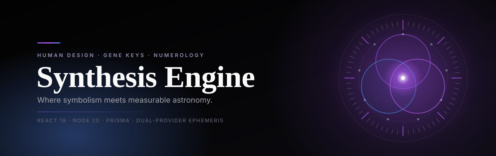
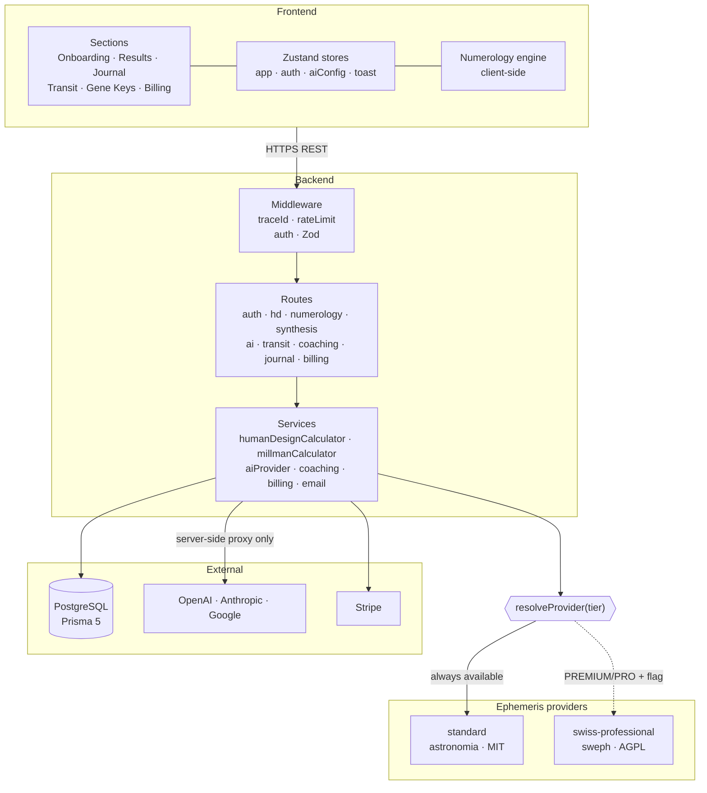
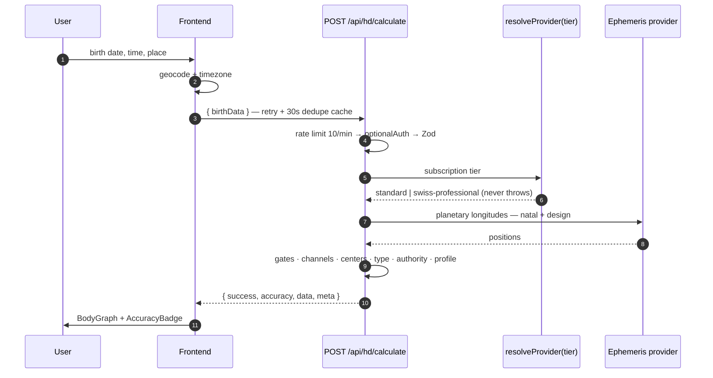

<div align="center">

<picture>
  <source media="(prefers-color-scheme: dark)" srcset=".github/assets/hero-dark.svg">
  <source media="(prefers-color-scheme: light)" srcset=".github/assets/hero-light.svg">
  
</picture>

<br>

**English** · [Deutsch](README.de.md)

<br>

[](#-project-status)
[](#-testing--quality)
[](LICENSE)

[](https://react.dev)
[](https://www.typescriptlang.org)
[](https://nodejs.org)
[](https://vitejs.dev)
[](https://prisma.io)
[](https://pnpm.io)

<br>

[**Why it's different**](#-why-this-is-not-another-astrology-app) ·
[**Features**](#-what-it-does) ·
[**Precision**](#-the-precision-ladder) ·
[**Architecture**](#-architecture) ·
[**API**](#-api-surface) ·
[**Status**](#-project-status) ·
[**Contact**](#-contact)

</div>

---

> **📌 About this repository.** Synthesis Engine is a commercial product under active
> development. The source code lives in a **private** repository — this one is a public
> showcase, documenting the architecture, the engineering decisions and the measured
> claims behind the product for anyone evaluating the work. Nothing here is a stub or a
> mockup: every number, diagram and design decision below describes the real, running
> system. If you'd like a closer look at the code — as a collaborator, an employer or an
> investor — see [Contact](#-contact).

**Synthesis Engine** takes one set of birth data and returns a single, cross-correlated
profile drawn from three symbolic systems — **Human Design**, **Gene Keys** and
**Dan Millman numerology** — then lets an LLM reason across all three at once.

The astronomy underneath is not decoration. Planetary positions are computed
server-side against a **published, reproducible accuracy benchmark**, and the
precision tier a request gets is an explicit, inspectable property of the response.

---

## ◈ Why this is not another astrology app

Most projects in this space ship one system, claim "precise calculations" without
a number, and quietly vendor a copyleft ephemeris. This one is built the other way
around.

| The usual | Here |
|---|---|
| One system, read in isolation | **Three systems**, cross-correlated into one synthesis |
| "Highly accurate" — no number given | **A measured error table**, asserted by an automated test against a Swiss Ephemeris fixture |
| AGPL library vendored into the main build | **License-isolated provider architecture** — CI fails the build if AGPL code reaches the standard image |
| "Your data never leaves your device" | **An honest data-flow statement** — the old claim was wrong after the web pivot, so it was retracted rather than kept |
| Trusts numbers the client sends | **The server recomputes everything it persists** |
| Secrets in `localStorage`, discovered later | **Automated tests assert tokens and API keys are never persisted** |

> The privacy line matters most. This project used to be a Tauri desktop app and
> advertised that birth data never left the machine. After the move to a web
> architecture that stopped being true — so the sentence was removed rather than
> reworded. See [Security & privacy](#-security--privacy) for what actually happens now.

---

## ◈ What it does

<table>
<tr>
<td width="50%" valign="top">

### ⬢ Human Design

Full BodyGraph from birth data — **9 centers**, energy type
(Manifestor · Generator · MG · Projector · Reflector), authority,
profile lines 1–6, all **64 gates** with planetary activations,
channel analysis and PHS variables, rendered as SVG.

</td>
<td width="50%" valign="top">

### ⬢ Gene Keys

All **64 keys** across the three frequencies —
**Shadow → Gift → Siddhi** — assembled into a hologenetic
profile with contemplation prompts.

</td>
</tr>
<tr>
<td width="50%" valign="top">

### ⬢ Millman Numerology

Life path (e.g. `35/8`), root numbers, master numbers (11 / 22),
zero-amplifier logic, soul path (vowels), career path (consonants),
the four challenges, peaks by life stage, personal year.

</td>
<td width="50%" valign="top">

### ⬢ AI Synthesis & Coaching

OpenAI · Anthropic · Google, always through a backend proxy —
never called directly from the browser. Socratic rather than
prescriptive, cross-correlating all three systems. Results cached
for 30 days.

</td>
</tr>
<tr>
<td width="50%" valign="top">

### ⬢ Transits

Daily planetary positions, comparison against the natal chart,
date-range scans and moon phases.

</td>
<td width="50%" valign="top">

### ⬢ Journal · PDF · Billing

Server-side journal tied to the account (guest mode stays local,
migrated once on first login), PDF export of charts and reports,
Stripe checkout, portal and webhooks.

</td>
</tr>
</table>

---

## ◈ The precision ladder

Astronomical accuracy is a **product tier**, not a marketing adjective. Two
interchangeable providers sit behind one `EphemerisProvider` interface, chosen per
request by a resolver that reads a subscription tier.

|  | `standard` | `swiss-professional` |
|---|---|---|
| **Tiers** | FREE · BASIC · guests | PREMIUM · PRO |
| **Library** | `astronomia` — Meeus (VSOP87, ELP2000-82) | Swiss Ephemeris (`sweph`) |
| **License** | **MIT** — ships in the default image | **AGPL** / commercial Astrodienst license |
| **Accuracy** | Sun `0.0059°` · Moon `0.0152°` · planets `≤ 0.0094°` | `±0.0001°` (reference) |
| **Chiron** | not available — reported explicitly in the response | included |
| **Native build** | none | node-gyp, feature-flagged build |

Measured against a Swiss Ephemeris 2.10.03 fixture across **10 dates from 1950–2030**.
For context, a Human Design gate spans **5.625°** — the standard provider's worst case
is roughly **370× narrower** than the smallest unit the chart can resolve. Retrograde
detection is exact in every sample.

**The resolver never throws.** Flag off, module missing, native load failure — each one
falls back silently to `standard`. A downgrade degrades precision; it never returns an
error.

```
EPHEMERIS_PRO_ENABLED=true  +  sweph loadable  +  tier ∈ {PREMIUM, PRO}
                              ↓ any condition unmet
                          standard provider
```

Every chart response carries its own provenance, and the UI surfaces it as an
`AccuracyBadge`:

```jsonc
{
  "success": true,
  "accuracy": "STANDARD",           // or "PROFESSIONAL"
  "data":  { /* chart */ },
  "meta":  {
    "ephemerisProvider": "standard",
    "usingEphemeris":    true,
    "missingBodies":     ["CHIRON"],
    "calculationTimeMs": 42
  }
}
```

---

## ◈ Architecture

Web-only. React 19 + Vite talks REST to Express + Prisma. **Every astronomical
calculation happens server-side.**



### How a chart request actually flows



<details>
<summary><b>Repository shape (private repo)</b></summary>

```
synthesis-engine/
├── app/            React 19 · Vite · TypeScript
│   ├── sections/   page-level flows
│   ├── pages/      route-level pages (dashboard, auth, billing)
│   ├── components/ domain components + shadcn/ui
│   ├── stores/     Zustand: app · auth · aiConfig · toast
│   ├── lib/        api · journal · numerology · gene keys
│   └── services/   PDF export (jsPDF + html2canvas)
│
├── backend/        Node 20 · Express 4 · Prisma 5
│   ├── routes/     9 routers mounted under /api
│   ├── middleware/ auth (JWT/RBAC/tier) · rate limiting · trace IDs
│   ├── services/   business logic, incl. the ephemeris provider architecture
│   ├── lib/        config · logging · SSRF guard · billing
│   └── tests/      Jest + Supertest, 214 cases
│
├── prisma/         schema · seed · hand-written SQL migrations
└── .github/        CI: lint → build → test, plus a Docker license guard
```

</details>

---

## ◈ API surface

Everything lives under `/api` behind a rate limiter (default **100 req/min**,
tunable). JSON bodies are capped at **1 MB**. A `/health` endpoint checks database
connectivity.

| Prefix | Endpoints | Access |
|---|---|---|
| `/auth` | register · login · refresh · logout · me · password reset · email verify | mixed — credential routes are separately rate-limited |
| `/hd` | calculate · save · profile · stats · health · diagnostics | `calculate` optional-auth · `diagnostics` **ADMIN** |
| `/numerology` | save · profile · stats · soulmates | mostly authenticated |
| `/synthesis` | generate · cache lookup | **PREMIUM / PRO**, rate-limited |
| `/ai` | proxy · models · cost estimate | `proxy`: **PREMIUM / PRO** only |
| `/transit` | daily · today · compare · range · moon-phases | mixed |
| `/coaching` | daily · mark-read · history | `daily`: **PREMIUM / PRO** |
| `/journal` | full CRUD | authenticated |
| `/billing` | checkout · portal · subscription · webhook | authenticated — webhook mounts ahead of the JSON parser for signature verification |

> **Two deliberate design decisions.** The auth rate limiter is attached **per route**,
> not to the whole `/auth` prefix — on the prefix it would throttle the endpoints the
> client calls on every app start. And the Stripe webhook is mounted ahead of the JSON
> body parser, because signature verification needs the raw body.

---

## ◈ Tech stack

<table>
<tr><td valign="top" width="50%">

**Frontend**

| | |
|---|---|
| React | 19.2 |
| TypeScript | 5.9 |
| Vite | 7.2 |
| Tailwind CSS | 3.4 |
| shadcn/ui (new-york) | Radix |
| Framer Motion | 12 |
| Zustand + immer | 5 |
| React Router | 8 |
| jsPDF + html2canvas | export |

</td><td valign="top" width="50%">

**Backend**

| | |
|---|---|
| Node.js | 20+ |
| Express | 4.18 |
| Prisma | 5.22 |
| PostgreSQL | 15+ |
| astronomia (MIT) | standard ephemeris |
| sweph (AGPL, optional) | professional ephemeris |
| OpenAI SDK | 4.x |
| Stripe | 22 |
| pino | logging |

</td></tr>
</table>

---

## ◈ Testing & quality

The backend test suite runs with **no database and no native compilation** — external
services are mocked so the suite is fast and deterministic.

| Scope | Runner | Coverage |
|---|---|---|
| Backend | Jest + Supertest | **214 cases / 20 suites** — auth, human design, rate limits, AI proxy, SSRF guard, coaching, journal, synthesis, billing + webhooks, email, ephemeris, tier matrix |
| Frontend | Vitest (happy-dom) | **49 cases / 8 suites** — calculations, journal & billing APIs, auth/AI-config stores, accuracy badge, auth pages |
| End-to-end | Playwright | smoke test across the core user path |

Three suites are **load-bearing security assertions**, not routine coverage:

- Two suites prove access tokens and AI provider keys are **never** written to browser
  storage. They were once skipped, and a false security claim shipped in the UI as a
  direct result — they stay in CI specifically to prevent a repeat.
- One suite holds the standard ephemeris provider to the Swiss Ephemeris reference
  fixture on every run, not just at implementation time.
- One suite exercises the full tier-resolution matrix and the calculation endpoint's
  contract for every subscription tier.

CI runs lint, build and test for both packages, plus a dedicated Docker job that builds
the standard image, **verifies it contains no AGPL-licensed ephemeris code**, boots it
against a real database, and checks that migrations applied — a license guard and a
runtime smoke test, not just "the build didn't fail."

---

## ◈ Security & privacy

**What actually happens to birth data.** It is sent to the product's own backend, where
the chart is computed. The **computed profiles** are what gets stored against the
account. Only derived profile data ever reaches an external AI provider, and only
through the backend proxy — never from the browser.

> ⚠️ Earlier versions of this product's documentation claimed birth data never left the
> device. That was true of an earlier desktop build and became false once the
> architecture moved to the web. It has been retracted rather than softened.

| | |
|---|---|
| **Token storage** | Access tokens and AI API keys are **never** written to browser storage — enforced by automated tests, not just a code review note |
| **Auth** | Short-lived JWT access tokens + a longer-lived refresh token in an httpOnly cookie · bcrypt password hashing · reset and verify tokens stored hashed, plaintext only in the email |
| **RBAC** | User / admin / super-admin roles plus subscription tiers, backed by an audit log |
| **No client trust** | Any endpoint that persists a chart recomputes it server-side rather than trusting a client-submitted result |
| **Outbound requests** | Custom AI endpoints pass through an SSRF guard, including the DNS resolution path |
| **Headers & CORS** | Security headers, compression, an explicit CORS allowlist |
| **Errors** | Stack traces and error details are only returned outside production |
| **Journal** | Server-side against the account; guest mode is local and unencrypted, migrated once on first login |

---

## ◈ Project status

Feature-complete for the core product and covered by CI. What remains is
commercial and operational rather than functional.

**Working** — HD charts · numerology · Gene Keys · transits · AI synthesis & coaching ·
journal · PDF export · JWT auth & RBAC · Stripe checkout, portal and webhooks
(code complete, payment account not yet live) · dual ephemeris providers with a
measured accuracy benchmark · Docker images for both precision tiers.

**Before a commercial launch:**

- [ ] **Payment provider setup** — the billing integration is written and tested; what's
      missing is the live account, products and webhook registration
- [ ] **First production deploy**
- [ ] **Professional ephemeris license** — *deferred by decision.* Needed only to enable
      the reference-accuracy tier for paying customers on the top plan. The default tier
      is MIT-licensed and unencumbered, so the product ships and sells without it; the
      license gets bought once paying customers justify serving the professional tier.

---

## ◈ License

This repository (documentation, diagrams, design assets) is **proprietary — all rights
reserved**. See [`LICENSE`](LICENSE). Reading it for evaluation is fine; copying,
reproducing or reusing the design, the diagrams or the written material elsewhere is
not, without written permission.

The underlying product's source code is closed and lives in a private repository. Third-
party dependencies keep their own licenses — the standard ephemeris tier runs on an
MIT-licensed library; the professional tier's library is AGPL-3.0 and is deliberately
excluded from the default build; running it publicly requires either complying with the
AGPL or a commercial license from its publisher.

---

## ◈ Contact

Interested in the product, the engineering behind it, or a closer look at the code —
as a collaborator, an employer, or an investor? Open an issue on this repository or
reach out through the profile linked from it.

---

<div align="center">

### Acknowledgements

**Human Design** — Ra Uru Hu · **Gene Keys** — Richard Rudd
**Numerology** — Dan Millman, *The Life You Were Born to Live*
**Swiss Ephemeris** — Astrodienst AG · **astronomia** — Jean Meeus algorithms

<br>

[⬆ Back to top](#) · [Deutsche Version](README.de.md)

</div>
